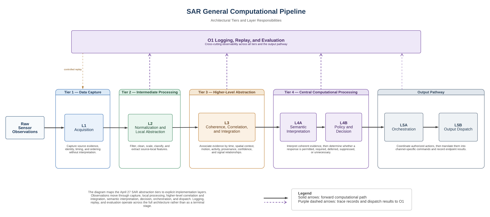

# SAR General Computational Pipeline Specification

*Document Class:* Generalized System Specification  
*Project:* Self-Aware-Room (SAR)  
*Status:* Version 1 baseline draft  
*Date:* 2026-07-18

## Version 1 - Architectural Baseline

## Documents

The list below is the ordered SAR computational specification set. The April 27 design baseline remains the root reference, and the later documents extend it in sequence.

These are document names, not layer labels; the layer mapping is defined later in the architecture section.

1. Design baseline (unchanged): `Oaa Self-aware Room – Design Specification 2026-04-27.pdf`
2. General computational pipeline specification (this document)
3. Shared data and interface contract
4. Coherence and Integration detailed specification
5. Component-level sensor-intake specifications
6. Semantic Representation detailed specification
7. Policy and Decision detailed specification
8. Orchestration and Output detailed specifications
9. Logging, Replay, and Evaluation detailed specification

## 1. Purpose

This document defines the generalized computational architecture from which SAR components inherit. It keeps the layer boundaries stable while leaving sensor-specific implementation, models, and deployment procedures to later documents.

### 1.1 General Objective

Define a generalized but implementable computational pipeline for SAR that remains reusable across sensing modalities, processing methods, semantic models, and output systems.

### 1.2 Architectural Positioning

SAR is organized as a sequence of mediated transformations rather than a fixed collection of devices. Raw observations are normalized, aligned, integrated, interpreted, evaluated against policy, and then translated into traceable output actions.

Coherence and integration are pre-semantic functions. Their job is to reconcile timing, space, identity, duplication, disagreement, and uncertainty before semantic interpretation occurs.

Logging, replay, and evaluation are cross-cutting functions. They observe and record processing across all layers rather than sitting at the end of the pipeline as a terminal stage.



The diagram above shows the forward computational path, the April 27 architectural tiers, and the cross-cutting observability plane.

## 2. Scope and Phasing

This section separates what is required in the baseline architecture from what can wait for later component documents or production hardening.

### 2.1 Included Scope

- end-to-end computational layer model,
- generalized packet and interface contracts,
- pre-semantics coherence and integration,
- semantic interpretation and policy boundaries,
- orchestration and output-stage handoff,
- uncertainty, degradation, and failure behavior,
- observability, replay, and evaluation,
- minimum conformance and acceptance criteria.

### 2.2 Excluded Scope

- sensor-specific acquisition and preprocessing implementation,
- modality-specific calibration procedures,
- model-specific prompts, inference tuning, or training procedures,
- detailed ontology and semantic-rule implementation,
- channel-specific cueing and device control,
- production deployment and operations runbooks,
- electrical, rigging, or physical installation procedures.

### 2.3 Phase Classification

The baseline should be read with the following phase tags in mind.

- **Required now:** layer boundaries, shared contracts, coherence before semantics, semantics before policy/decision, orchestration before dispatch, observability across layers, provenance, uncertainty, degradation, timing, and spatial-frame identification where relevant.
- **Required when applicable:** spatial registration, entity tracking, event association, duplicate handling, conflict resolution, human review flags, endpoint acknowledgements, replay, and comparative evaluation.
- **Recommended for prototypes:** explicit no-state and indeterminate outputs, raw-payload references, local feature extraction, fallback behavior, and versioned schema records.
- **Deferred for production-grade implementation:** exhaustive conformance machinery, full ontology specification, detailed channel mappings, deployment runbooks, and hardened operational policies.

## 3. Generalized Architecture

The SAR computational architecture separates responsibilities so each layer can evolve without collapsing the system into a single implementation.

### 3.1 Processing Topology

The forward-processing path is:

```text
L1 Acquisition
 -> L2 Normalization
 -> L3 Coherence and Integration
 -> L4A Semantic Interpretation
 -> L4B Policy and Decision
 -> L5A Orchestration
 -> L5B Output Dispatch
```

The cross-cutting observability plane is:

```text
O1 Logging, Replay, and Evaluation
     | observes L1, L2, L3, L4A, L4B, L5A, and L5B
     | records transitions, failures, uncertainty, decisions, and dispatch outcomes
     | supports replay, comparison, diagnosis, and system evaluation
```

Implementations may distribute these functions across hardware and software, but the conceptual boundaries and handoff contracts must remain intact.

### 3.2 Object Types

The generalized pipeline distinguishes among a small set of core object types. Some are mandatory in Phase 1; others become useful as the system matures.

- `observation`: a source-derived measurement or source-local frame.
- `state`: a bounded estimate of room or subsystem condition.
- `semantic_state`: an interpreted representation of what the system believes is occurring.
- `decision`: a policy-evaluated determination about whether or how the system should respond.
- `intent`: an abstract request for system behavior.
- `execution_plan`: an orchestrated set of prioritized and timed actions.
- `dispatch`: a channel-specific command sent to an output endpoint.
- `evaluation_record`: a trace, metric, comparison, or diagnostic result.

Phase 1 should treat `observation` and `state` as mandatory. The other object types are required only when the relevant layer is active, and several may be optional in early prototypes.

## 4. Layer Definitions

### 4.1 L1 Acquisition

L1 captures physical or digital source signals without interpretation. Its job is to preserve source identity, timing, and raw evidence so downstream layers receive consistent input.

#### 4.1.1 Responsibilities

- ingest raw streams from supported sensing and digital sources,
- preserve source-local ordering where available,
- attach source identity and capture timing metadata,
- buffer non-blocking input for downstream handling,
- expose source health, availability, and acquisition errors,
- preserve access to raw or minimally transformed payloads where required for audit or replay.

#### 4.1.2 Output Contract

L1 emits source-local `observation` objects with enough provenance and timing information for deterministic normalization.

L1 must not emit semantic conclusions or room-level state.

#### 4.1.3 Valid Degraded Outputs

L1 may emit explicit status records for:

- source unavailable,
- source degraded,
- incomplete frame,
- timestamp unavailable or unreliable,
- dropped input,
- buffer overflow,
- unsupported payload.

### 4.2 L2 Normalization

L2 turns modality-specific observations into canonical forms while preserving traceability to the originating source data. In this specification, canonical forms are stable observation structures with standardized field names, units, value ranges, data types, timestamps, and quality or uncertainty markers so downstream layers can process inputs consistently across modalities.

#### 4.2.1 Responsibilities

- convert modality-specific input into canonical observation structures,
- classify observation type,
- normalize field names, units, ranges, and data types,
- attach quality and uncertainty indicators,
- preserve references to raw payloads where required,
- perform local feature extraction when defined by the component specification,
- identify invalid, incomplete, or out-of-range observations.

#### 4.2.2 Output Contract

L2 emits modality-normalized `observation` objects with stable schemas suitable for generic downstream processing.

Normalization may derive source-local features, but it must not perform cross-source reconciliation or room-level semantic interpretation.

#### 4.2.3 Valid Degraded Outputs

L2 may emit explicit status records for:

- normalization failure,
- invalid schema,
- unsupported unit or range,
- quality below component threshold,
- calibration unavailable,
- feature extraction failure,
- raw-reference unavailable.

### 4.3 L3 Coherence and Integration

L3 combines independent normalized observations into a bounded, confidence-weighted estimate of room or subsystem state. In this architecture, coherence means the degree to which observations can reasonably be treated as evidence of the same event, entity, region, or state.

#### 4.3.1 Responsibilities

- align asynchronous observations within defined temporal windows,
- register observations into a shared spatial reference where applicable,
- associate observations with candidate events or entities,
- detect duplicate, overlapping, or mutually dependent evidence,
- correlate evidence across modalities,
- preserve supporting and contradicting evidence,
- apply conflict-resolution policy,
- compute confidence, uncertainty, and coherence measures,
- assemble a bounded room-state estimate,
- preserve provenance from integrated state back to source observations.

#### 4.3.2 Required Generalized Functions

- temporal alignment,
- spatial registration,
- event and entity association,
- cross-modal correlation,
- duplicate-evidence handling,
- conflict resolution,
- confidence and uncertainty aggregation,
- bounded world-state assembly.

#### 4.3.3 Output Contract

L3 emits `event`, `entity`, and `state` objects suitable for semantic interpretation.

The principal room-level output should be described as a `room_state_estimate` or `coherent_state_frame`, not as an absolute or globally synchronized truth state.

#### 4.3.4 Valid Degraded Outputs

L3 must support explicit outcomes including:

- coherent,
- partially coherent,
- conflicting,
- insufficient evidence,
- temporally incompatible,
- spatially incompatible,
- indeterminate,
- stale,
- degraded due to missing source,
- invalid due to calibration or registration failure.

Low-confidence or indeterminate state must be represented explicitly rather than silently dropped or converted into false certainty.

### 4.4 L4A Semantic Interpretation

L4A translates coherent state into structured operational meaning. It determines what the system believes is occurring without yet deciding whether an action should be taken.

#### 4.4.1 Responsibilities

- interpret coherent state estimates,
- map state into defined semantic categories,
- generate semantic events and conditions,
- identify relevant entities and relationships,
- preserve confidence and uncertainty,
- expose alternative interpretations when required,
- emit no-interpretation or indeterminate outcomes when evidence is insufficient.

#### 4.4.2 Output Contract

L4A emits `semantic_state` objects containing an interpretation, confidence, provenance, and validity interval.

A valid semantic interpretation may result in no action.

#### 4.4.3 Scope Boundary

Detailed ontology, semantic rules, model behavior, and inference procedures belong in the Semantic Representation detailed specification.

### 4.5 L4B Policy and Decision

L4B evaluates semantic state against deterministic rules, safety constraints, permissions, priorities, and higher-level decision logic.

#### 4.5.1 Responsibilities

- apply deterministic safety and policy gates before discretionary interpretation,
- determine whether action is permitted, required, deferred, suppressed, or unnecessary,
- distinguish observation from intervention,
- resolve competing candidate responses,
- record the basis for each decision,
- emit explicit no-action and deferred-action decisions.

#### 4.5.2 Output Contract

L4B emits `decision` and `intent` objects.

Each decision must identify:

- the semantic state evaluated,
- the policy or rule basis,
- the decision outcome,
- the confidence or certainty level,
- any constraints passed to orchestration,
- whether human review is required.

#### 4.5.3 Scope Boundary

Detailed policies, permissions, decision rules, and model behavior belong in the Policy and Decision detailed specification.

### 4.6 L5A Orchestration

L5A turns one or more action intents into a coordinated execution plan. It resolves priority, timing, dependencies, and resource constraints before anything is sent to an output endpoint.

#### 4.6.1 Responsibilities

- resolve priorities among simultaneous intents,
- schedule and synchronize actions,
- coordinate multimodal outputs,
- enforce timing, dependency, and resource constraints,
- apply fallback and cancellation behavior,
- ensure that only validated intents advance to dispatch,
- produce an auditable execution plan.

#### 4.6.2 Output Contract

L5A emits `execution_plan` objects containing ordered or timed actions, target channels, dependencies, constraints, and fallback behavior.

### 4.7 L5B Output Dispatch

L5B translates execution-plan actions into channel-specific commands and records whether endpoints accepted, rejected, or failed to execute them.

#### 4.7.1 Responsibilities

- map abstract actions to device or software commands,
- validate endpoint availability and command compatibility,
- transmit commands to authorized endpoints,
- record dispatch timing and result,
- report acknowledgement, rejection, timeout, partial completion, or failure,
- prevent direct execution of unvalidated intents.

#### 4.7.2 Output Contract

L5B emits `dispatch` and dispatch-result records.

Detailed mappings for audio, projection, lighting, control systems, digital-twin updates, or other channels belong in dedicated output-stage specifications.

## 5. O1 Logging, Replay, and Evaluation

O1 is a cross-cutting observability plane spanning all processing layers. It records what happened, supports replay, and provides evidence for debugging and evaluation.

### 5.1 Responsibilities

- record layer inputs, outputs, transitions, and processing results,
- record source health, degradation, and failure conditions,
- preserve trace relationships across observations, state, decisions, intents, plans, and dispatches,
- support deterministic or best-effort replay,
- support comparative evaluation across software versions, models, policies, and configurations,
- expose operational and research metrics,
- support diagnosis without undocumented oral knowledge,
- enforce applicable privacy, retention, and access-control rules.

### 5.2 Minimum Observability Requirement

Every processing layer must emit sufficient structured records to determine:

- what input it received,
- what transformation it attempted,
- what output it produced,
- what uncertainty or failure occurred,
- how long processing took,
- which software, configuration, schema, or model version was used.

## 6. Shared Data and Interface Contracts

Shared contracts provide end-to-end traceability while allowing each layer to define payloads appropriate to its responsibility.

### 6.1 Required Cross-Layer Fields

Unless explicitly marked inapplicable by a component specification, transmitted objects should include:

- `object_id`,
- `object_type`,
- `schema_version`,
- `originating_layer`,
- `source_id` or integrated source set,
- `capture_timestamp`,
- `processing_timestamp`,
- `valid_from`,
- `valid_until` or temporal window,
- `spatial_context`,
- `coordinate_frame_id` where applicable,
- `confidence`,
- `uncertainty`,
- `quality_status`,
- `provenance`,
- `trace_id` or correlation identifier,
- `payload`,
- `error_status` or degradation status,
- `component_version`,
- `configuration_version`.

Detailed schemas, required/optional status, allowed values, and serialization formats belong in the Shared Data and Interface Contract.

### 6.2 Provenance Requirement

Every derived object must retain enough provenance to trace it to:

- its direct input objects,
- the component and version that transformed it,
- the configuration or policy applied,
- the time of transformation.

A decision must be traceable to the semantic state and policies that produced it. A semantic state must be traceable to coherent state. Coherent state must be traceable to normalized and source observations.

### 6.3 Time Requirement

Implementations must distinguish among:

- source capture time,
- receipt time,
- processing time,
- validity interval,
- dispatch time,
- acknowledgement or completion time.

A single undifferentiated `timestamp` field is insufficient for system-wide conformance.

### 6.4 Spatial Requirement

Any object with spatial meaning must identify the coordinate frame in which its spatial values are expressed.

Objects lacking valid spatial calibration must not be silently treated as registered room-space evidence.

## 7. Coherence and Integration Framework

### 7.1 Core Questions

Before advancing state to semantic interpretation, L3 must determine:

- whether observations are temporally compatible,
- whether observations are spatially compatible,
- whether they refer to the same event, entity, region, or state,
- whether they are independent, duplicate, supporting, or contradicting evidence,
- whether confidence is sufficient for interpretation,
- what uncertainty remains,
- what bounded state estimate should be advanced,
- whether the correct output is indeterminate or no-state.

### 7.2 Generalized Processing Sequence

1. Receive normalized observations.
2. Validate schema, timing, quality, and calibration status.
3. Window observations according to event class and temporal requirements.
4. Register spatially meaningful observations into a shared coordinate frame.
5. Associate candidate observations with events, entities, regions, or states.
6. Identify duplicate or dependent evidence.
7. Correlate supporting and contradicting evidence.
8. Apply conflict-resolution and confidence-aggregation policy.
9. Assemble a bounded coherent state estimate.
10. Emit state, uncertainty, provenance, and coherence status.
11. Emit observability records to O1.

### 7.3 No-State and Indeterminate Outcomes

The absence of a confident state estimate is a valid computational result.

L3 must not fabricate a unified state when observations are missing, stale, incompatible, or contradictory beyond the allowed threshold.

## 8. Failure, Degradation, and Safety Behavior

Failure and uncertainty are part of the architecture and must be represented explicitly.

### 8.1 General Requirements

Each layer must:

- define valid failure and degradation states,
- preserve the last known valid state only when explicitly allowed,
- identify stale data,
- avoid converting missing evidence into negative evidence,
- expose confidence or uncertainty changes,
- support safe fallback behavior,
- prevent unauthorized or unsafe output execution,
- record failures and recoveries through O1.

### 8.2 Output Safety Boundary

No output endpoint may execute an action directly from raw observation, normalized observation, coherent state, or unvalidated semantic interpretation unless a dedicated specification explicitly defines and authorizes a constrained emergency pathway.

Normal operation requires progression through policy validation, orchestration, and dispatch.

### 8.3 Human Review

Component specifications must identify circumstances in which:

- human approval is required,
- output is suppressed pending review,
- the system may observe but not act,
- privacy or ethical constraints limit capture, interpretation, storage, or output.

## 9. Relationship to Sensor Intake Phase 1

The current audio-first sensor-intake specification should be treated as **Test Case 01 (Audio-first)** against this generalized pipeline.

### 9.1 Mapping Rules

- capture and source-local buffering map to L1,
- modality normalization and local feature extraction map to L2,
- cross-stream reconciliation and room-level state assembly map to L3,
- semantic interpretation maps to L4A,
- policy evaluation and action selection map to L4B,
- multimodal coordination maps to L5A,
- device-specific output commands map to L5B,
- logging, replay, and evaluation requirements map to O1.

Sensor-intake documents must not redefine generalized layer boundaries.

## 10. Required Follow-on Specifications

### 10.1 Priority Specification Queue

1. Shared Data and Interface Contract
2. Coherence and Integration detailed specification
3. Sensor Intake: Audio Test Case 01 (existing, to be aligned)
4. Sensor Intake: Thermal Test Case
5. Sensor Intake: mmWave/Presence Test Case
6. Sensor Intake: Vision/Camera Test Case
7. Semantic Representation detailed specification
8. Policy and Decision detailed specification
9. Orchestration detailed specification
10. Output Stage detailed specifications (audio, video, control, digital twin)
11. Logging, Replay, and Evaluation detailed specification

## 11. Conformance Requirements

A component specification conforms to this generalized specification only when it:

- identifies its layer or cross-cutting-plane position,
- identifies the object classes it consumes and emits,
- defines input and output contracts,
- preserves provenance,
- distinguishes capture, processing, validity, and dispatch timing where applicable,
- defines uncertainty, degradation, and failure behavior,
- identifies coordinate frames for spatial data,
- emits observability records,
- does not perform responsibilities assigned to another layer without an explicitly documented exception,
- does not bypass policy, orchestration, or dispatch boundaries for normal output execution,
- identifies schema, component, configuration, and policy versions,
- supports traceability from output actions back to source evidence.

## 12. Acceptance Criteria for This General Specification

This document may be accepted as the active generalized computational reference when:

- layer boundaries are explicit and non-overlapping,
- coherence and integration are defined as pre-semantic functions,
- semantic interpretation is distinguished from policy and decision,
- orchestration is distinguished from device dispatch,
- observability is represented as a cross-cutting plane,
- representational object classes are defined,
- shared contracts include provenance, timing, uncertainty, versioning, and degradation status,
- indeterminate and no-state outcomes are valid,
- component specifications can map to the architecture without redefining it,
- every decision can be traced to semantic state and policy,
- every dispatch can be traced to a validated intent and execution plan,
- sensor-specific specifications cannot send raw observations directly to normal output execution,
- implementation teams can determine whether a component is conformant without relying on undocumented assumptions.

## 13. Working Principle

The SAR computational architecture should remain stable at the level of transformations, contracts, and mediation boundaries while allowing sensors, models, processors, policies, and output systems to evolve.

The room should not be described as possessing complete or anthropomorphic self-awareness. Within this architecture, self-awareness refers operationally to the system's capacity to observe aspects of its own environment and condition, form bounded and uncertainty-aware representations, interpret those representations, and produce traceable responses under explicit policy and safety constraints.
